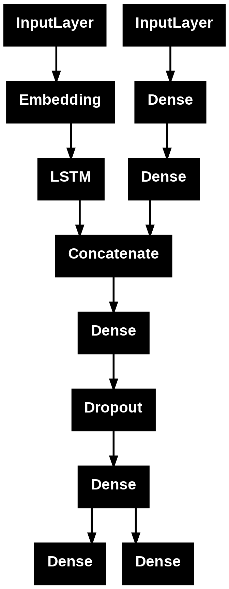

## Technical Stack

- **Framework**: TensorFlow/Keras with Functional API
- **Data Processing**: NumPy, Pandas for preprocessing pipeline
- **Evaluation**: Scikit-learn for cross-validation and metrics
- **Optimization**: Custom hyperparameter search implementation

# Deep Learning Exam Implementation

This repository contains the implementation of my Deep Learning exam project for the course "Machine Learning, Artificial Neural Networks and Deep Learning".

## Exam Format 
(Here is the [full text of the exam](docs/exam_test.pdf))

The exam consisted in **designing a complete neural network architecture from scratch without access to the dataset** with pen and paper. Later, we had to deliver a Colab notebook implementation that **faithfully adhered** to our written design choices, with no changes allowed.  

## The Problem Proposed: Multi-Modal Sentiment Analysis
The challenge involved a dataset containing reviews about hotels, requiring the design of a deep neural network able to predict the review type and/or the review score from heterogeneous data types: unstructured review text, temporal patterns, geographic distributions, and hotel metadata.

## Architecture Design 
I chose to predict both the review type (positive/negative) and the review score (numerical value) through the implementation of a **multi-input, multi-output neural network implemented with the Keras Functional API**.

### Multi-Modal Processing
- **Text Branch**: Embedding layer → LSTM (64 units) for sequential text processing
- **Categorical Branch**: Dense layers for structured feature processing  
- **Fusion Layer**: Concatenation with additional dense processing
- **Multi-Output Head**: Simultaneous classification and regression prediction

### Key Design Decisions
- **Functional API**: Required for complex multi-input/multi-output topology
- **LSTM with tanh activation**: Chosen for sequential text processing and gradient stability
- **Weighted loss combination**: Binary crossentropy + MSE with equal weighting
- **Stratified evaluation**: Maintains class balance across validation folds

## Data Engineering Pipeline

### Text Processing
- Vocabulary extraction and integer encoding (11,445 unique tokens)
- Sequence padding to fixed length (400 tokens)
- Minimal stopword removal preserving sentiment indicators

### Feature Engineering
- **Temporal**: Date extraction → seasonal categorization (4 classes)
- **Geographic**: Nationality mapping → continental groupings (10 classes)
- **Popularity**: Review count → quartile-based hotel tiers (4 classes)
- **Encoding**: One-hot vectors for all categorical variables (18 total features)

## My Solution  

### Training Strategy
- **Optimizer**: Adam with learning rate optimization
- **Regularization**: Dropout and early stopping
- **Batch processing**: Dynamic batch size tuning
- **Hyperparameter search**: Random search across learning rates, dropout rates, and architecture parameters

## Evaluation Methodology

### Cross-Validation Results
- **5-fold stratified validation** maintaining class balance
- **Validation accuracy**: 50.48% ± 0.85%
- **Validation MAE**: 1.84 ± 0.06
- **Generalization assessment**: Independent test set evaluation

### Optimization Process
- Systematic hyperparameter search across learning rates [0.0005-0.005], batch sizes [32-128], and dropout rates [0.1-0.3]
- Model architecture tuning for LSTM units [32-128]
- Performance monitoring across classification and regression tasks

## Repository Structure

├── notebooks/
│   └── deep_learning_exam_implementation.ipynb    # Complete implementation
├── docs/
│   └── exam_test.pdf                             # Original exam assignment text
├── image.png                                      # Network visualization
└── README.md

The original dataset (`input_data.pkl`) is no longer publicly available. (This is why there is no requirements.txt here)

Done by me, ialwayslikegrime / grimey_s